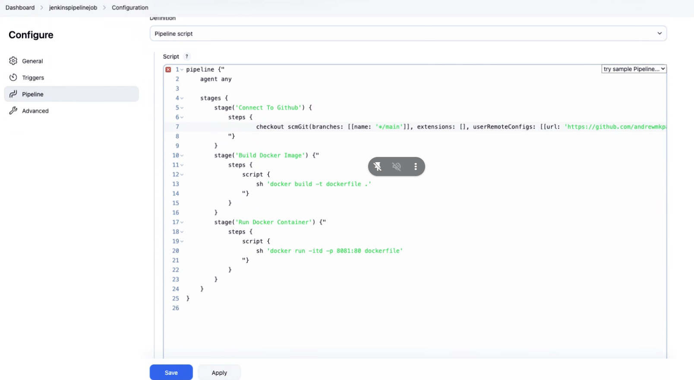
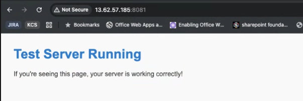

# Jenkins Pipeline Job: Dockerized HTML Deployment

This project demonstrates how to create a Jenkins pipeline job that builds a Docker image containing a static HTML file and deploys it using a Jenkins EC2 instance.

---

## 🔧 Project Objective

To Automate the deployment of a simple static HTML page using Jenkins CI/CD pipeline and Docker, hosted on an AWS EC2 instance.

---

## 📦 Project Structure

```
jenkinspipelinejob/
├── Dockerfile
├── index.html
├── Jenkinsfile
└── README.md
```

---

## 🚀 Prerequisites

- Jenkins installed and running on an AWS EC2 instance
- Docker installed and configured
- GitHub webhook integration set up
- Jenkins pipeline with GitHub project connected

---

## 🐳 Docker Installation on EC2 (Jenkins Host)

To install Docker and configure permissions on your EC2 instance running Jenkins:

```bash
sudo yum update -y
sudo yum install docker -y
sudo usermod -aG docker ec2-user
newgrp docker
sudo systemctl enable docker
sudo systemctl start docker
```

---

## 🔧 Jenkins Configuration

### GitHub Webhook
In the Jenkins UI:
- Enable **GitHub hook trigger for GITScm polling** under **Build Triggers** to automatically trigger builds on `git push`.

### Jenkinsfile

The pipeline logic is defined in the `Jenkinsfile`. Below is a visual representation of the configuration:



---

## 🛠️ Troubleshooting Docker Permissions

### ❗ Error Encountered:

```
ERROR: permission denied while trying to connect to the Docker daemon socket at unix:///var/run/docker.sock: 
Get "http://%2Fvar%2Frun%2Fdocker.sock/_ping": dial unix /var/run/docker.sock: connect: permission denied
```

### ✅ Solution:

1. Add the Jenkins user to the Docker group:
    ```bash
    sudo usermod -aG docker jenkins
    ```

2. Restart Jenkins:
    ```bash
    sudo systemctl restart jenkins
    ```

This allows the Jenkins user to access the Docker socket without using `sudo`.

---

## ✅ Successful Build Output

After pushing your changes to GitHub, Jenkins picks up the commit via the webhook and builds the Docker image successfully. The HTML file is served through a container exposed on a custom port (`8082` in this case).



---

## 🌍 Result

You can access your deployed HTML page at:

```
http://<EC2-PUBLIC-IP>:8082
```

---

## 📌 Notes

- Ensure port `8082` is open in your EC2 security group.
- To change the port, modify the `docker run` line in the `Jenkinsfile`. Example:
    ```groovy
    sh 'docker run -itd -p 8082:80 dockerfile'
    ```


